# Help Desk

    
    
    
    
     
    
    
    
     
    
     
    

Help Desk is a Laravel based project, that let you manage your support tickets and communicate with your customers, with
a beautiful and simple to use platform.

Help Desk is based on the latest version of Laravel and any other Open Source packages and technologies.

# Version 2

Take a look to the a newer version containing the same options and more:

[https://github.com/devaslanphp/project-management](https://github.com/devaslanphp/project-management)

Below are the analyzes reported by SonarCloud. 

> This project has just started so don't be afraid if there are big numbers :satisfied:

## Screenshots

    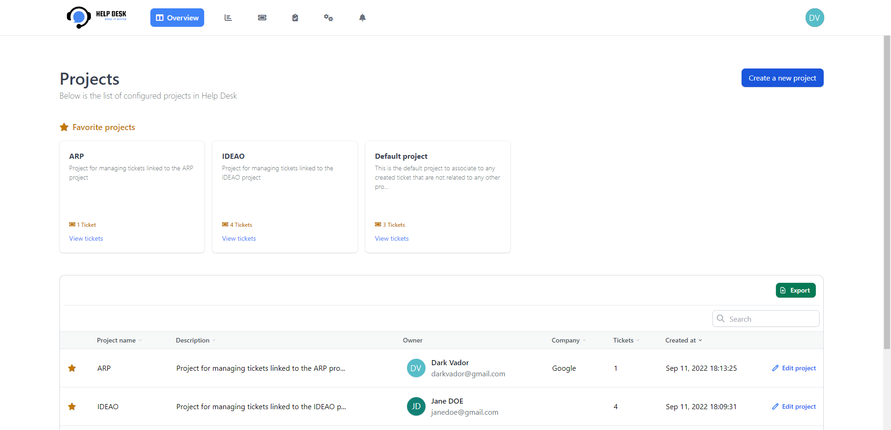</img> 
    </img> 
    </img> 
    </img> 
    </img> 
    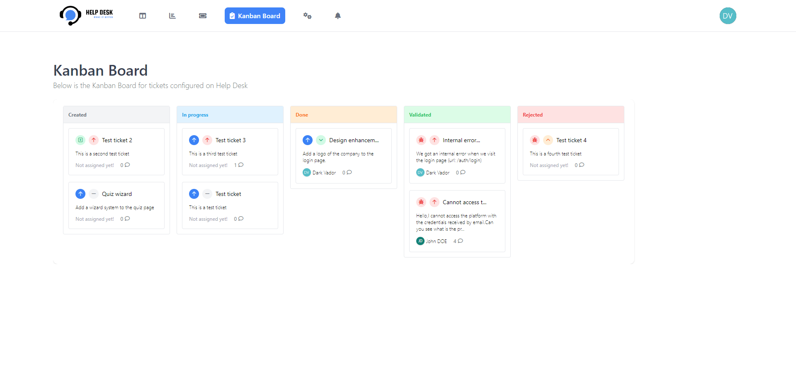</img> 
    </img> 
    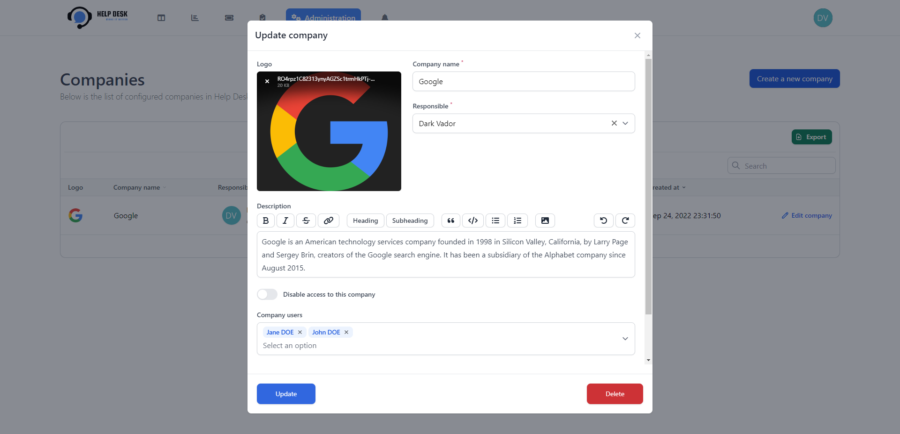</img> 
    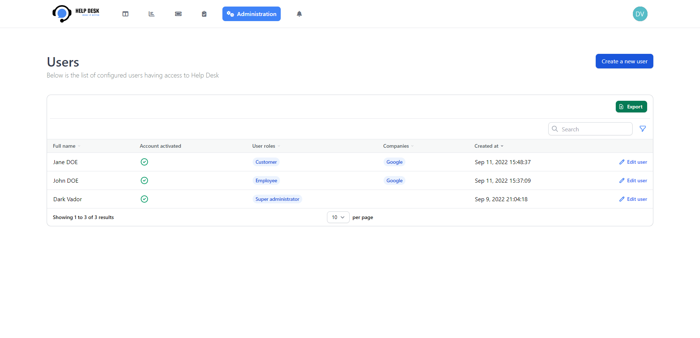</img> 
    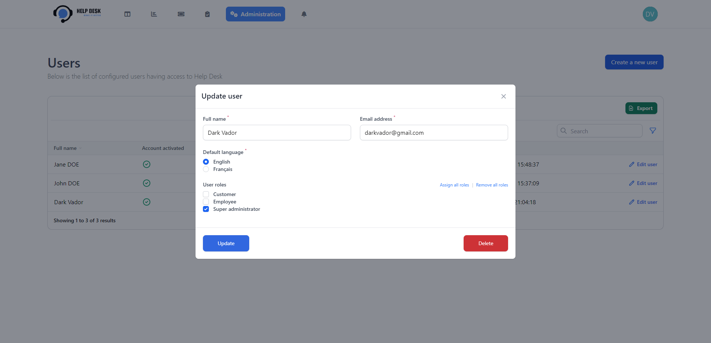</img> 
    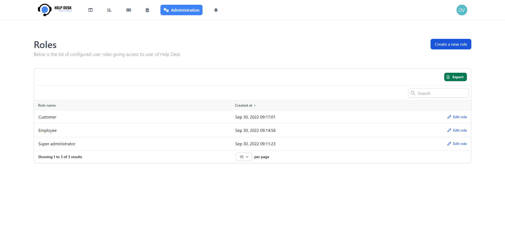</img> 
    </img> 
    </img> 
    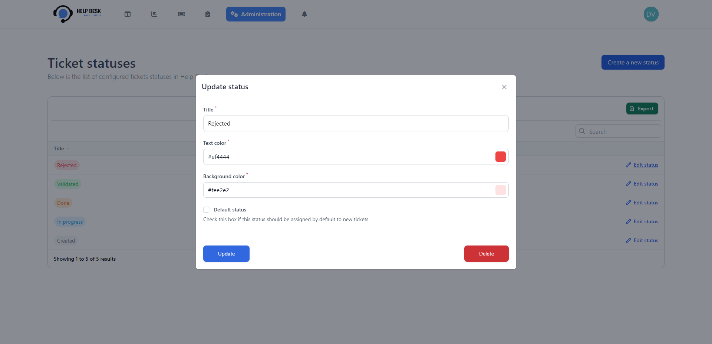</img> 
    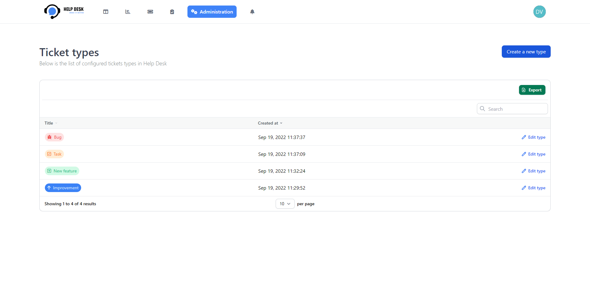</img> 
    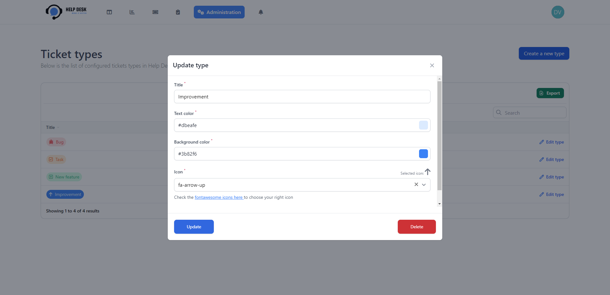</img> 
    </img> 
    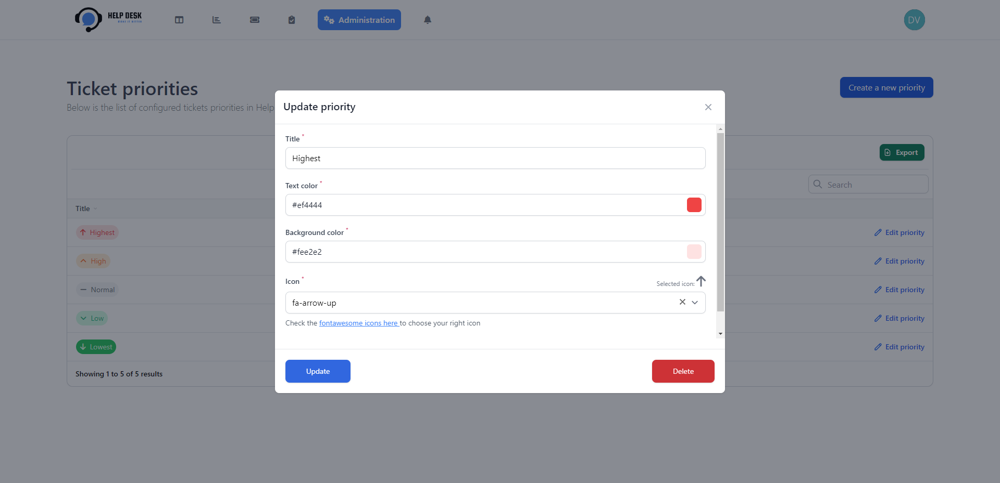</img> 
    </img> 
    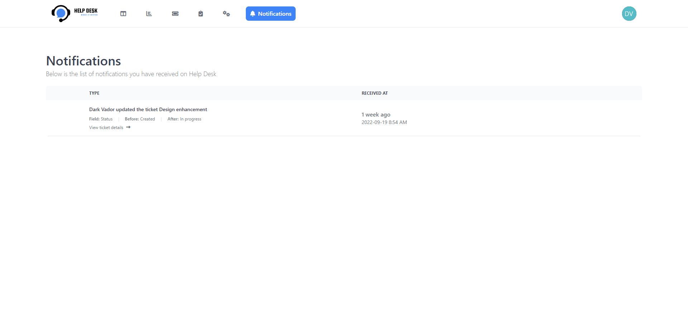</img> 
    </img> 
    </img> 
    </img> 

## Online demo

You can check our online demo here: [Online demo](http://helpdesk.devaslan.com/)

> **Use the following accounts to access demo:**
> 
> *Important: The save / delete users functions are disabled only in demo instance*
>
> **Administrator**
> - Email: darkvador@gmail.com
> - Password: secret
>
> **Customer**
> - Email: janedoe@gmail.com
> - Password: secret
>
> **Employee**
> - Email: johndoe@gmail.com
> - Password: secret

## Documentation

You can find a full documentation here: [Documentation](https://devaslanphp.github.io/help-desk/)

## Work in progress

We are always working to make Help Desk a better application, to have more information about tasks and features in progress, you can see the [Help Desk project](https://github.com/orgs/devaslanphp/projects/1).

## Credits

- [All Contributors](https://github.com/devaslanphp/help-desk/graphs/contributors)

## License

The MIT License (MIT). Please see [License File](LICENSE.md) for more information.

## Support us

