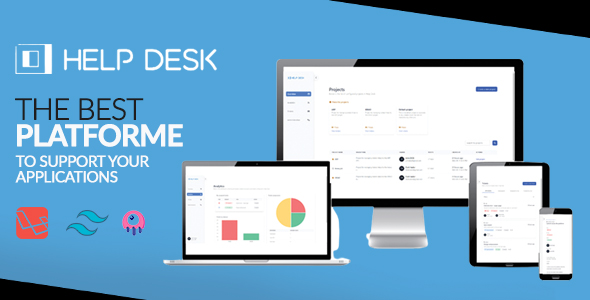

# Help Desk

    
    
    
    

Help Desk is a Laravel based project, that let you manage your support tickets and communicate with your customers, with a beautiful and simple to use platform.

Help Desk is based on the latest version of Laravel and any other Open Source packages and technologies.

## Online demo

You can check our online demo here: [Online demo](http://helpdesk.devaslan.com/)

Use the following accounts to access demo:

*Administrator*

- Email: darkvador@gmail.com
- Password: secret

*Customer*

- Email: janedoe@gmail.com
- Password: secret

*Employee*

- Email: johndoe@gmail.com
- Password: secret

## Documentation

You can find a full documentation here: [Documentation](http://helpdesk.devaslan.com/docs/)

## Credits

- [All Contributors](https://github.com/heloufir/filament-workflow-manager/graphs/contributors)

## License

The MIT License (MIT). Please see [License File](LICENSE.md) for more information.

## Support us

